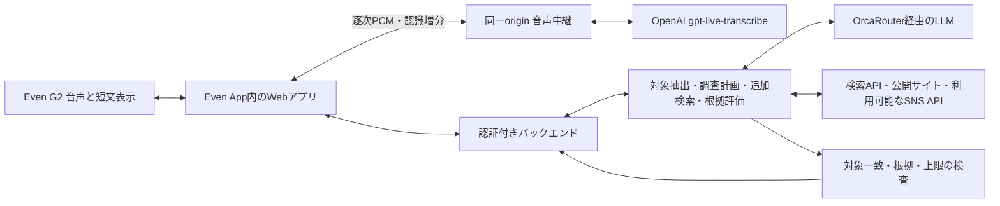

# 02 エージェント・安全性・復旧設計

> 2026-09-22 / v0.5。要件確認を受けた初期設計に、真正ストリーミング会話モード・4件同時表示を反映。[決定記録](../DECISIONS.md)に従い、Even G2と既存接続方式を採用。制御・数値は実装の目標／制限。試験結果・未達は[実装検証記録](../validation/MVP_IMPLEMENTATION.md)を参照。公式AI-DLCの段階承認とは区別する。

## 構成と自律性

既存G2試作のVite/TypeScript、SDK接続、3段表示、入力、PCM転送口、QR/パッケージ配布を引き継ぐ。STT・Web調査・OrcaRouter・認証/復旧を新規接続する。[連携詳細](../EVEN_G2_INTEGRATION.md)。

エージェントは検索語・情報源を選び、不足なら会社名/登壇等で絞り追加調査し、矛盾する事実を棄却する。目標達成・根拠不足・時間/費用上限で終了する。再計画と終了判断を記録し、自律性の証拠にする。権限・上限・出力検証はモデルの判断から独立したコードで強制する。

## 状態と共有契約

`idle → capturing → transcribing → resolving → awaiting_confirmation（必要時）→ researching → verifying → ready / partial / no_evidence / failed / cancelled`

| データ | 主な項目 |
| --- | --- |
| 識別 | sessionId、requestId（1対象調査）、subjectRevision（対象の版）、eventId（単調増加） |
| 抽出対象 | personName?、companyName?、candidateId?、selectionStatus、inputMode |
| 根拠 | sourceId、url、title、retrievedAt、publishedAt?、excerpt、subjectMatchReason |
| カード | cardId、fact、suggestedQuestion、sourceIds、expiresAt、requestId、subjectRevision |
| 実行記録 | status、reasonCode、costKnown、cost、currency、attempts、inputMode、displayMode |

Schema/型を共有し送受信時に検査する。外部データを型キャストだけで信用しない。未知イベント/巨大応答/不正URLは拒否。1セッションの調査は同時1件。対象変更で旧処理をキャンセルし、返却時・表示前にrequestId/subjectRevisionを照合する。受付重複はrequestId、応答の重複/順序逆転はeventIdで排除する。

## 対象照合と根拠採用

1. 音声の暫定文では調査を開始せず、確定した名前/会社を使う。スマホから訂正できる。
2. 自動採用は会社公式/本人公式の記述で氏名と所属が対応し、他候補との矛盾がない場合。氏名だけ・同名SNSだけ・LLMの確信度だけで確定しない。
3. 複数候補・所属変更・言及対象が不明なら候補選択へ。未選択時は会社一般情報か停止。本人確認済みと表示しない。
4. 趣味は本人の明示した公開記述のみ。写真/フォローから親しい関係を推定しない。共同登壇は共同登壇という事実として表現する。
5. 事実と取得本文を照合。検索抜粋しか読めなければ裏取り完了としない。矛盾は追加検索、未解決なら棄却。出典URLは取得結果のsourceIdから選び、LLMにURLを創作させない。
6. 根拠ゼロと取得不可を区別。別人への差替えや架空の補完で成功扱いしない。

公開一次情報を別途確認した氏名・会社・別名の対応だけを限定的に利用する。現在の対応には「ちょまど＋Microsoft」から`@chomado`への解決がある。任意の愛称をXへ解決できる保証ではなく、新しい事実・現在の法人への所属の証明にも使わない。カードごとの根拠・人物への帰属・矛盾検査は省略しない。

## 継続会話と4件表示

利用者が説明・同意を確認して「会話モードを開始」した場合だけ、音声入力を`start({ continuous: true })`／`startAudio({ continuous: true })`で開始する。30秒の総時間・累積量による停止はこの開始方法だけ解除し、通常の`start()`／`startAudio()`は最大30秒を維持する。

入力は16 kHz・mono・PCM16。マイク層は各フレームの出力とリサンプリングの端数だけを扱い、ブラウザーは同一originの`/api/asr` WebSocketへ音声を即時送信する。接続準備中だけ最大2秒分を保持し、送信待ちも上限を超えたら停止する。サーバーは24 kHzへ変換し、OpenAI `gpt-live-transcribe`へ直接送る。認識増分は即時表示し、約5秒ごとのmanual commitで確定した発話を、OrcaRouterによる人物・会社の抽出と調査へ渡す。人物抽出・調査は直列で最新の確定発話だけを待機させ、その間もASRは別接続で継続する。複数人物・会社不足は確認へ戻す。12秒窓を8秒間隔で送る旧処理は会話モードから外す。

同じ氏名・会社の組について、結果ありなら120秒、結果なしなら30秒の再検索を抑制する。人物抽出ごとに異なる要求IDを割り当て、ASR・人物抽出・調査を共通の会話予算へ集計する。ASRは音声送信量と接続経過時間の大きい方で1分単位の最大額を先行予約する。人物抽出最大100回、認証セッション最大15分、承認済み予算上限を守る。終了・同意解除・非表示・切断・上限で停止し、明示再開なしに録音や有料処理を再開しない。停止後の遅延結果は破棄する。

認証済みの`POST /api/conversation/stream`で会話に結び付けた単回チケットを発行し、WebSocketの最初のauthメッセージで交換する。OpenAIキーはサーバーだけに保持し、URLやブラウザーへ出さない。`OPENAI_API_KEY`と`STREAMING_ASR_MAX_USD_PER_MINUTE`が不足する場合は無効とする。公式契約は[OpenAI Realtime transcription](https://developers.openai.com/api/docs/guides/realtime-transcription)を参照。従来の短い録音には[OrcaRouter input_audio](https://docs.orcarouter.ai/advanced/audio-input)等を使い分ける。PCの公開英語音声で増分受信を確認済みだが、日本語・G2実音声での遅延や精度は未検証。

検証済みカードは0〜4件。スマホは2×2、G2本文は16pxで事実・質問の各2行×4組を576×144内に描画し、左右288×144の画像2枚を直列送信する。画像API・Canvasが使えない、または画像が拒否された場合は従来の通常文字へ縮退する。未確認の枠を生成で埋めない。幅は描画時に計測し、省略は「…」で示す。全文・引用・出典はスマホの詳細で確認する。前後操作は詳細の選択だけを切り替え、G2の4件一覧は維持する。SDKの受付は実機の表示・可読性・音声品質を検証したことにはならない。

## 操作境界

| 操作 | 区分・制御 |
| --- | --- |
| マイク開始・音声認識への送信 | 人が説明/同意を確認して開始。短い録音は最大30秒、明示開始の会話は人物抽出回数・認証・予算上限。停止操作と手入力代替 |
| 抽出、公開調査、裏取り、カード生成 | 許可された道具・上限の内側で自律 |
| 曖昧な候補/訂正/別人物への切替 | 人が確認。candidateIdとsubjectRevisionに結び付ける |
| 話題の採用 | 会話する利用者が判断。自動発話・相手への送信は行わない |
| 非公開収集、ログイン壁回避、DM/投稿、秘密取得 | 道具として提供しない |

## データ・権限

- 原音はSTTに必要な短いバッファのみ。永続ストレージ/ログへ保存しない。転送不能時に無制限に溜めず、欠損表示後に再入力へ。
- 検索には人名・会社名等の必要語だけ送る。調査LLMへ会話全文を渡さない。各提供者のデータ保持条件を利用前に確認する。
- 個人データを含むサーバー状態は暗号化し、会話セッションのTTLは最大15分に固定する。明示終了で発言断片・候補・カード・状態を削除要求。遅延応答で復活させない。
- 端末の永続保存は非機密の表示設定を基本とし、認証用の例外は後述の専用HttpOnly Cookieだけとする。復帰時は再認証と有効セッション照会。利用者の再開操作までは過去カードを非表示とし、録音・有料調査は自動再開しない。外部提供者の保持/請求記録まで消えたとは断言しない。
- APIキーはサーバーのみ。APIキーや利用コードを`VITE_*`、G2パッケージ、QR、ブラウザの永続領域へ置かない。QRに12時間の端末認証トークンを含めない。初回入力を省略する専用QRのみ、認証済み利用者が発行する単回・10分のログイン用トークンをURLフラグメントに含められる。ページ起動時にフラグメントを削除し、同一originのPOSTで交換する。発行元セッションが有効な間だけ利用でき、交換時に新規の空セッションと12時間の端末記憶を作る。録音・調査は開始しない。端末記憶用Cookieと短期Bearerを区別し、アクセスと実行数を制限する。
- 外部ページは資料として扱い、命令に従わない。ツール許可リストを固定し、本文から権限/送信先を変更しない。
- ページ取得はHTTP(S)の公開宛だけ。内部/loopback/link-local、資格情報付きURL、非許可ポートを拒否し、DNS解決後・redirect先にも同じ検査。応答サイズ・時間を制限する。
- 削除後も個人に結び付かない日次費用集計を維持し、終了/再起動で予算をリセットしない。
- 通常ログは匿名run ID、状態、回数、時間、モデル、費用、エラー分類。人名・全文・原音・秘密を記録しない。詳細な審査トレースは架空データで作る。

### 端末の認証を12時間記憶する

初回の利用コード認証時に「この端末では12時間、利用コードの入力を省略する」を提示し、既定はオンとする。選択された場合だけランダムな端末トークンを会話用とは別のCookieに保存する。Cookieは`HttpOnly`・`SameSite=Strict`、HTTPSでは`Secure`とする。サーバーの`.private/`配下に保存する端末記憶の情報はトークンのハッシュと有効期限だけで、コード・APIキーをブラウザへ永続保存しない。

再訪時は有効なCookieを使った`POST /api/session/restore`で自動再認証し、新しい短期Bearerを発行する。端末記憶の期限は発行から12時間に固定し、再訪・復元で延長しない。会話セッションの15分TTLは変更しない。過去カードは利用者の「再開」後にだけ表示し、録音・有料調査は自動再開しない。

「終了して削除」で会話とその端末の記憶をサーバー側で失効させ、利用コードの変更でも以前の記憶を無効にする。SafariとEven Appの保存領域は別とし、それぞれで初回認証する。Even AppのWebViewでのCookie保持は実機未確認であり、記憶が失われた場合や期限切れはコード入力へ戻す。

## 上限

| 項目 | 上限・定義 |
| --- | --- |
| 音声 | 短い録音は1回30秒。会話は逐次PCM送信・増分即表示・約5秒ごと確定。準備中は最大2秒分、送信待ちも上限で停止。音声接続は会話につき1本 |
| 人物抽出 | 会話につき最大100回。抽出・調査は直列、ASRは別接続で継続 |
| 同じ対象の再検索 | 結果あり120秒、結果なし30秒を抑制。氏名と会社の組で判定 |
| 調査時間 | 対象確定後20秒。最初のカード中央値10秒目標。音声認識/人の確認待ちは別計測 |
| 調査の呼出 | 1対象につき検索2クエリ、ページ4件、LLM3回。再試行・修復も含む。会話のASR・人物抽出にも同じ会話予算を適用 |
| 外部HTTP待ち | 最大8秒か全体残り時間の短い方 |
| 再試行 | 一時障害のみ操作ごと最大1回、全体上限優先 |
| カード | 最大4組を同時表示。不足枠は未確認、対象変更/終了で失効。5分で再確認表示 |
| 会話セッション | 最大15分。端末記憶で保持期間を延ばさない |
| 端末の認証記憶 | 発行から12時間、固定期限・自動延長なし |
| 金額 | 承認済みの1調査（会話モードは会話全体）・1日・イベント全体の上限をサーバー設定で強制。通貨・最大見積の設定が不足すればlive無効 |

新規呼出前に、実費＋予約済み見込額＋次操作の最大見積で判定。見積不能なら新規live呼出を止める。STT・検索・モデル・基盤を合算、不明を0円としない。請求確定が遅いAPIには留保額を設ける。

## 復旧

| 事象 | 動作・証拠 |
| --- | --- |
| 429 / 5xx | 残り時間内ならRetry-After等を尊重し最大1回。間に合わなければ検証済みの部分結果 |
| timeout / 費用不明 | 未完了を記録。二重課金の可能性を見込額に残し、安全性/予算が不明なら再送しない |
| 不正AI応答 | Schema/根拠検査で棄却。修復1回まで、LLM合計3回以内。検証前は表示しない |
| SNS不可・検索ゼロ | 公式サイトへ縮退。取得不可と根拠ゼロを区別 |
| STT失敗 | 抽出を空で返し、手入力/再録音へ。欠損音声を全文扱いしない |
| G2切断 | 音声停止要求とスマホ通知。送信受付と実機表示成功を区別。切断前の表示が残る場合を実機で検証 |
| WebView停止/再起動 | 再認証後に有効runとeventIdを照会、利用者の再開操作後に提示。失効/終了済みは復元せず、音声は別途明示再開 |
| 401 / 403 | 自動権限拡張せず連携停止、スマホに設定不足を表示 |
| 対象変更/停止 | cancellationと版チェックで遅延結果を棄却。取消不能な既発行呼出の費用は記録 |

次：[実装と検証](03_BUILD_AND_VERIFY.md)。
