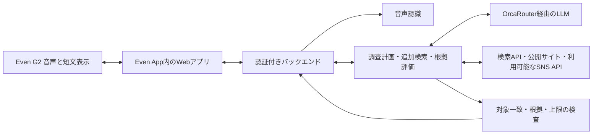

# 02 エージェント・安全性・復旧設計

> 2026-09-22 / v0.2。独自の設計草案。Even G2と既存接続方式を採用。制御・数値は提案で未実装、AI-DLCの正式な承認は未実施。

## 構成と自律性

既存G2試作のVite/TypeScript、SDK接続、3段表示、入力、PCM転送口、QR/パッケージ配布を引き継ぐ。STT・Web調査・OrcaRouter・認証/復旧を新規接続する。[連携詳細](../EVEN_G2_INTEGRATION.md)。

エージェントは検索語・情報源を選び、不足なら会社名/登壇等で絞り追加調査し、矛盾する事実を棄却する。目標達成・根拠不足・時間/費用上限で終了する。再計画と終了判断を記録し、自律性の証拠にする。権限・上限・出力検証はモデルの判断から独立したコードで強制する。

## 状態と共有契約

`idle → capturing → transcribing → resolving → awaiting_confirmation（必要時）→ researching → verifying → ready / partial / no_evidence / failed / cancelled`

| データ | 主な項目 |
| --- | --- |
| 識別 | sessionId、requestId（1対象調査）、subjectRevision（対象の版）、eventId（単調増加） |
| 抽出対象 | personName?、companyName?、candidateId?、selectionStatus、inputMode |
| 根拠 | sourceId、url、title、retrievedAt、publishedAt?、excerpt、subjectMatchReason |
| カード | cardId、fact、suggestedQuestion、sourceIds、expiresAt、requestId、subjectRevision |
| 実行記録 | status、reasonCode、costKnown、cost、currency、attempts、inputMode、displayMode |

Schema/型を共有し送受信時に検査する。外部データを型キャストだけで信用しない。未知イベント/巨大応答/不正URLは拒否。1セッションの調査は同時1件。対象変更で旧処理をキャンセルし、返却時・表示前にrequestId/subjectRevisionを照合する。受付重複はrequestId、応答の重複/順序逆転はeventIdで排除する。

## 対象照合と根拠採用

1. 音声の暫定文では調査を開始せず、確定した名前/会社を使う。スマホから訂正できる。
2. 自動採用は会社公式/本人公式の記述で氏名と所属が対応し、他候補との矛盾がない場合。氏名だけ・同名SNSだけ・LLMの確信度だけで確定しない。
3. 複数候補・所属変更・言及対象が不明なら候補選択へ。未選択時は会社一般情報か停止。本人確認済みと表示しない。
4. 趣味は本人の明示した公開記述のみ。写真/フォローから親しい関係を推定しない。共同登壇は共同登壇という事実として表現する。
5. 事実と取得本文を照合。検索抜粋しか読めなければ裏取り完了としない。矛盾は追加検索、未解決なら棄却。出典URLは取得結果のsourceIdから選び、LLMにURLを創作させない。
6. 根拠ゼロと取得不可を区別。別人への差替えや架空の補完で成功扱いしない。

## 操作境界

| 操作 | 区分・制御 |
| --- | --- |
| マイク開始・STTへの送信 | 人が説明/同意を確認して開始。停止、30秒上限、手入力代替 |
| 抽出、公開調査、裏取り、カード生成 | 許可された道具・上限の内側で自律 |
| 曖昧な候補/訂正/別人物への切替 | 人が確認。candidateIdとsubjectRevisionに結び付ける |
| 話題の採用 | 会話する利用者が判断。自動発話・相手への送信は行わない |
| 非公開収集、ログイン壁回避、DM/投稿、秘密取得 | 道具として提供しない |

## データ・権限

- 原音はSTTに必要な短いバッファのみ。永続ストレージ/ログへ保存しない。転送不能時に無制限に溜めず、欠損表示後に再入力へ。
- 検索には人名・会社名等の必要語だけ送る。調査LLMへ会話全文を渡さない。各提供者のデータ保持条件を利用前に確認する。
- 個人データを含むサーバー状態は暗号化、最大15分のTTL案。明示終了で発言断片・候補・カード・状態を削除要求。遅延応答で復活させない。
- 端末の永続保存は非機密の表示設定を基本とする。復帰時は再認証と有効セッション照会。利用者の再開操作までは過去カードを非表示とし、マイクは別途明示再開。外部提供者の保持/請求記録まで消えたとは断言しない。
- APIキーはサーバーのみ。`VITE_*`、G2パッケージ、QR、ブラウザ保存に秘密を置かない。短期認証、利用者別アクセス、実行数制限を用意する。
- 外部ページは資料として扱い、命令に従わない。ツール許可リストを固定し、本文から権限/送信先を変更しない。
- ページ取得はHTTP(S)の公開宛だけ。内部/loopback/link-local、資格情報付きURL、非許可ポートを拒否し、DNS解決後・redirect先にも同じ検査。応答サイズ・時間を制限する。
- 削除後も個人に結び付かない日次費用集計を維持し、終了/再起動で予算をリセットしない。
- 通常ログは匿名run ID、状態、回数、時間、モデル、費用、エラー分類。人名・全文・原音・秘密を記録しない。詳細な審査トレースは架空データで作る。

## 上限（作業用提案）

| 項目 | 上限・定義 |
| --- | --- |
| 音声 | 1回30秒、並列録音なし |
| 調査時間 | 対象確定後20秒。最初のカード中央値10秒目標。STT/人の確認待ちは別計測 |
| 呼出 | 検索2クエリ、ページ4件、LLM3回。再試行・修復も含む |
| 外部HTTP待ち | 最大8秒か全体残り時間の短い方 |
| 再試行 | 一時障害のみ操作ごと最大1回、全体上限優先 |
| カード | 最大3枚、対象変更/終了で失効。5分で再確認表示 |
| 金額 | 1調査・1日・イベント全体の上限は未定。通貨を含め設定するまでlive無効 |

新規呼出前に、実費＋予約済み見込額＋次操作の最大見積で判定。見積不能なら新規live呼出を止める。STT・検索・モデル・基盤を合算、不明を0円としない。請求確定が遅いAPIには留保額を設ける。

## 復旧

| 事象 | 動作・証拠 |
| --- | --- |
| 429 / 5xx | 残り時間内ならRetry-After等を尊重し最大1回。間に合わなければ検証済みの部分結果 |
| timeout / 費用不明 | 未完了を記録。二重課金の可能性を見込額に残し、安全性/予算が不明なら再送しない |
| 不正AI応答 | Schema/根拠検査で棄却。修復1回まで、LLM合計3回以内。検証前は表示しない |
| SNS不可・検索ゼロ | 公式サイトへ縮退。取得不可と根拠ゼロを区別 |
| STT失敗 | 抽出を空で返し、手入力/再録音へ。欠損音声を全文扱いしない |
| G2切断 | 音声停止要求とスマホ通知。送信受付と実機表示成功を区別。切断前の表示が残る場合を実機で検証 |
| WebView停止/再起動 | 再認証後に有効runとeventIdを照会、利用者の再開操作後に提示。失効/終了済みは復元せず、音声は別途明示再開 |
| 401 / 403 | 自動権限拡張せず連携停止、スマホに設定不足を表示 |
| 対象変更/停止 | cancellationと版チェックで遅延結果を棄却。取消不能な既発行呼出の費用は記録 |

次：[実装と検証](03_BUILD_AND_VERIFY.md)。
